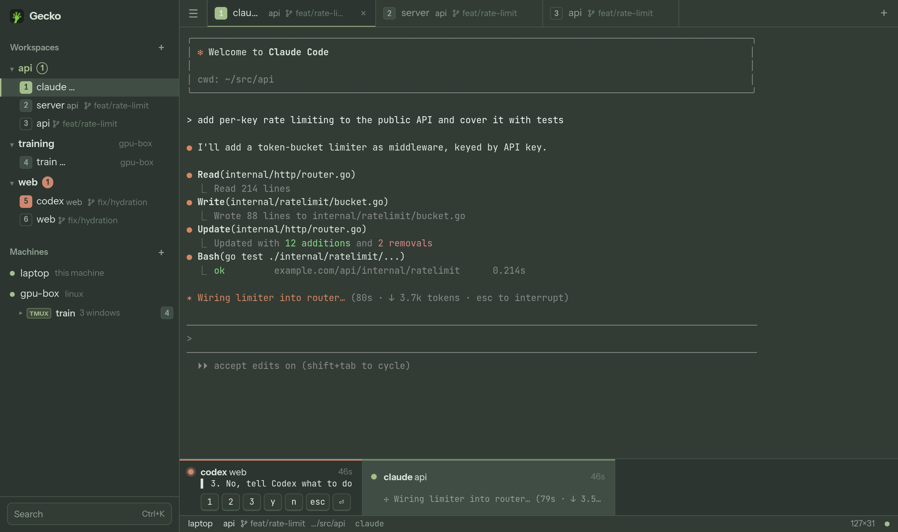

<p align="center">
  
</p>

<p align="center">
  <a href="docs/features.md">Features</a> ·
  <a href="docs/install.md">Install</a> ·
  <a href="docs/machines.md">Machines</a> ·
  <a href="docs/mobile.md">Phone</a> ·
  <a href="docs/themes.md">Themes</a> ·
  <a href="docs/keyboard.md">Keyboard</a> ·
  <a href="docs/config.md">Config</a> ·
  <a href="docs/architecture.md">Architecture</a>
</p>

<h1 align="center">Gecko</h1>

<p align="center">
  <b>The terminal for running coding agents across all your machines.</b><br>
  Sessions that survive anything. Agents you can see at a glance. From your desktop or your phone.
</p>

<p align="center">
  
</p>

```sh
git clone https://github.com/eternaleclipse/gecko && cd gecko
make install      # needs Go 1.22+ and Node 18+
gecko             # starts the daemon and opens the app
```
