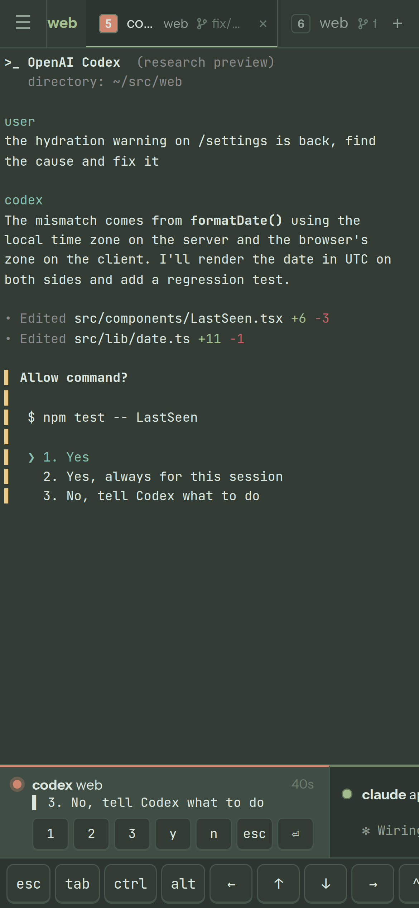

# Phone and tablet

[Docs](README.md)

By default the daemon listens on `127.0.0.1:7681` only. To use it from your
phone:

- **Tailscale (recommended):** `tailscale serve 7681`. You get HTTPS, so
  clipboard and notifications work fully.
- **LAN:** `gecko daemon --listen 0.0.0.0:7681`, or set `"listen"` in the
  config.

Then pick **Open on another device** in the palette and scan the QR code. The
link carries your access token. It is kept as a cookie, so treat the link like
a password.

The mobile layout has:

- A drawer with workspaces, agents and machines.
- A key bar: esc, tab, sticky ctrl/alt, arrows, `^C`, pgup/pgdn, select,
  paste.
- A **compose** box for writing prompts with your keyboard's autocorrect.
  Multi-line text goes to agents as a single bracketed paste.

